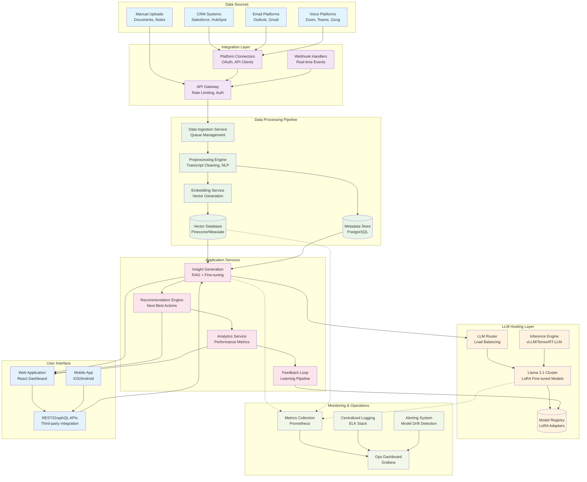

# System Architecture Diagram

## Overview

The AI Sales-Enablement Platform follows a microservices architecture designed for scalability, privacy, and seamless integration with existing sales infrastructure. The system processes sales interactions (calls, emails, CRM data) through an intelligent pipeline that generates actionable insights while maintaining complete data privacy.

## System Architecture

## Component Descriptions

### Data Sources Layer
- **CRM Systems**: Integration with Salesforce, HubSpot, and other CRM platforms
- **Email Platforms**: Connection to Outlook, Gmail for email analysis
- **Voice Platforms**: Integration with Zoom, Teams, Gong for call transcript processing
- **Manual Uploads**: Support for document and note uploads

### Integration Layer
- **API Gateway**: Centralized entry point with authentication, rate limiting, and routing
- **Webhook Handlers**: Real-time event processing from external platforms
- **Platform Connectors**: OAuth-based connectors for secure third-party integrations

### Data Processing Pipeline
- **Data Ingestion**: Queue-based system for handling high-volume data streams
- **Preprocessing Engine**: Transcript cleaning, NLP preprocessing, and data normalization
- **Embedding Service**: Vector generation using state-of-the-art embedding models
- **Vector Database**: High-performance vector storage for similarity search
- **Metadata Store**: Relational database for structured data and relationships

### LLM Hosting Layer
- **LLM Router**: Intelligent load balancing across model instances
- **Llama 3.1 Cluster**: Horizontally scaled deployment of fine-tuned models
- **Model Registry**: Version control and storage for LoRA adapters
- **Inference Engine**: Optimized inference using vLLM or TensorRT-LLM

### Application Services
- **Insight Generation**: RAG-enhanced LLM for generating sales insights
- **Recommendation Engine**: AI-powered next best action suggestions
- **Analytics Service**: Performance tracking and business intelligence
- **Feedback Loop**: Continuous learning from user interactions and outcomes

### Monitoring & Operations
- **Metrics Collection**: Comprehensive system and model performance monitoring
- **Centralized Logging**: Structured logging for debugging and audit trails
- **Alerting System**: Proactive monitoring for model drift and system issues
- **Operations Dashboard**: Real-time visibility into system health and performance

## Data Flow Architecture

1. **Ingestion**: External data sources push/pull data through the integration layer
2. **Processing**: Raw data is cleaned, preprocessed, and converted to embeddings
3. **Storage**: Vectors and metadata are stored in optimized databases
4. **Inference**: User queries trigger RAG-enhanced LLM inference
5. **Response**: Generated insights are delivered through various interfaces
6. **Learning**: User feedback and outcomes feed back into the training pipeline

## Security & Privacy

- **Data Isolation**: Complete on-premises deployment with no external data sharing
- **Encryption**: End-to-end encryption for data in transit and at rest
- **Access Control**: Role-based access control with audit logging
- **Compliance**: GDPR, SOC2, and industry-specific compliance support
