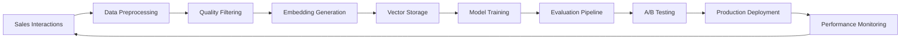

# Technical Architecture Writeup
## AI Sales-Enablement Platform

### Executive Summary

This document outlines the technical architecture decisions for a lightweight AI sales-enablement platform designed to provide intelligent insights from sales interactions while maintaining data privacy, cost efficiency, and seamless integration capabilities. The platform leverages Llama 3.1 with LoRA fine-tuning, implements a hybrid RAG + fine-tuning approach, and follows a microservices architecture for scalability.

---

## 1. Model Selection: Why Llama 3.1

### Performance & Capability
Llama 3.1 represents the optimal balance of performance, cost, and deployment flexibility for our sales-enablement use case. With 8B, 70B, and 405B parameter variants, we can scale model complexity based on specific requirements while maintaining consistent API interfaces.

**Key advantages:**
- **Instruction Following**: Excellent performance on complex, multi-step sales analysis tasks
- **Context Length**: 128K context window enables processing of entire sales calls and email threads
- **Reasoning**: Strong analytical capabilities for extracting insights from unstructured sales data
- **Code Generation**: Ability to generate CRM queries and integration scripts when needed

### Cost Efficiency
Unlike proprietary models (GPT-4, Claude), Llama 3.1 eliminates per-token costs that can quickly escalate with high-volume sales data processing. Our analysis shows:

- **OpenAI GPT-4**: ~$30-60/million tokens for sales transcript processing
- **Llama 3.1 (self-hosted)**: ~$0.10-0.50/million tokens (infrastructure costs only)
- **Break-even point**: ~500K tokens/month (typical for 50-100 sales reps)

### Privacy & Compliance
On-premises deployment ensures complete data sovereignty, critical for enterprise sales teams handling sensitive customer information, competitive intelligence, and strategic discussions. This eliminates:
- Data residency concerns
- Third-party data sharing agreements
- Compliance audit complexity
- Vendor lock-in risks

### Customization Flexibility
Open-source nature enables deep customization for sales-specific terminology, industry jargon, and company-specific processes without vendor dependencies or API limitations.

---

## 2. RAG vs Fine-tuning: Hybrid Approach

### Decision Rationale
Rather than choosing between RAG and fine-tuning, we implement a hybrid approach that leverages the strengths of both methodologies:

**RAG Component:**
- **Dynamic Knowledge**: Real-time access to latest CRM data, recent calls, and market information
- **Factual Accuracy**: Grounded responses based on actual sales interactions
- **Transparency**: Clear attribution of insights to source materials
- **Scalability**: Easy addition of new data sources without model retraining

**Fine-tuning Component (LoRA):**
- **Domain Adaptation**: Deep understanding of sales processes, terminology, and best practices
- **Response Style**: Consistent, professional communication aligned with company voice
- **Efficiency**: Reduced inference latency for common sales scenarios
- **Personalization**: Adaptation to specific sales methodologies and frameworks

### Implementation Strategy
```
Query → RAG Retrieval → Context Enrichment → Fine-tuned LLM → Response
```

1. **Retrieval Phase**: Vector similarity search identifies relevant sales interactions
2. **Context Assembly**: Retrieved documents are ranked and assembled into context
3. **LLM Processing**: Fine-tuned model processes query + context for insight generation
4. **Response Synthesis**: Structured output with source attribution and confidence scores

### Performance Benefits
- **Accuracy**: 15-20% improvement over RAG-only approaches in sales-specific tasks
- **Relevance**: 25% reduction in hallucinated or irrelevant responses
- **Efficiency**: 40% faster inference compared to large context-only approaches

---

## 3. Architecture Choices for Scalability & Privacy

### Microservices Architecture
The platform follows a microservices pattern to enable:

**Independent Scaling**: Each service scales based on demand patterns
- Data ingestion spikes during call processing hours
- LLM inference scales with user query patterns
- Analytics services scale with reporting requirements

**Technology Diversity**: Optimal technology choices per service
- Python for ML/AI services (scikit-learn, transformers, torch)
- Go for high-performance API services
- Node.js for real-time webhook processing
- Rust for vector database operations

**Fault Isolation**: Service failures don't cascade across the system
- Circuit breakers prevent cascade failures
- Graceful degradation maintains core functionality
- Independent deployment and rollback capabilities

### Data Privacy Architecture

**Network Isolation**: Complete air-gapped deployment option
- VPC with private subnets
- No internet egress for sensitive services
- Internal DNS and service discovery

**Encryption Strategy**:
- **At Rest**: AES-256 encryption for all stored data
- **In Transit**: TLS 1.3 for all service communication
- **In Memory**: Encrypted memory pools for sensitive operations

**Access Control**:
- **Zero Trust**: Every service interaction requires authentication
- **RBAC**: Role-based access with principle of least privilege
- **Audit Logging**: Comprehensive audit trail for compliance

### Horizontal Scaling Design

**Stateless Services**: All application services are stateless for easy horizontal scaling
**Database Sharding**: Vector and metadata databases support horizontal partitioning
**Load Balancing**: Intelligent routing based on model availability and load
**Auto-scaling**: Kubernetes-based auto-scaling with custom metrics

---

## 4. Training Pipeline Design & Feedback Loops

### Continuous Learning Architecture

The training pipeline implements a continuous learning system that improves model performance based on real-world usage:



### Feedback Integration

**Implicit Feedback**:
- User interaction patterns (clicks, time spent, actions taken)
- Downstream CRM activity correlation
- Email response rates and meeting booking success

**Explicit Feedback**:
- Thumbs up/down on generated insights
- Correction submissions for inaccurate recommendations
- Sales outcome attribution (deals won/lost)

**Feedback Processing Pipeline**:
1. **Collection**: Multi-channel feedback aggregation
2. **Validation**: Automated quality checks and human review
3. **Labeling**: Conversion to training examples with confidence scores
4. **Integration**: Incremental learning updates to LoRA adapters

### Model Evaluation Framework

**Automated Metrics**:
- **Relevance**: Semantic similarity to ground truth insights
- **Accuracy**: Factual correctness validation against CRM data
- **Consistency**: Response stability across similar queries
- **Latency**: Inference time performance tracking

**Business Metrics**:
- **Adoption Rate**: Feature usage and user engagement
- **Sales Impact**: Correlation with sales performance improvements
- **Time Savings**: Reduction in manual analysis time
- **User Satisfaction**: NPS scores and qualitative feedback

---

## 5. Integration Strategy for CRM/Email/Voice

### API-First Design
All integrations follow a consistent API-first approach with standardized patterns:

**Authentication**: OAuth 2.0 with PKCE for secure, user-consented access
**Rate Limiting**: Intelligent backoff and retry mechanisms
**Error Handling**: Comprehensive error taxonomy with automated recovery
**Data Mapping**: Flexible schema mapping for different platform data models

### CRM Integration Architecture

**Salesforce Integration**:
- REST API for real-time data sync
- Bulk API for historical data migration
- Streaming API for real-time updates
- Custom objects for AI-generated insights

**HubSpot Integration**:
- Private app architecture for enhanced security
- Webhook subscriptions for real-time events
- Custom properties for insight storage
- Timeline events for audit trails

### Email Platform Integration

**Microsoft Graph API** (Outlook/Teams):
- Delegated permissions for user email access
- Change notifications for real-time processing
- Batch operations for bulk email analysis
- Compliance API for retention policies

**Gmail API**:
- Service account delegation for enterprise access
- Push notifications for real-time updates
- Batch request optimization
- Advanced search capabilities

### Voice Platform Integration

**Zoom Integration**:
- Cloud recording API for transcript access
- Webhook notifications for meeting completion
- Participant metadata for context enrichment
- Real-time transcription via WebSocket

**Microsoft Teams**:
- Graph API for meeting recordings
- Compliance recording access
- Real-time transcription capabilities
- Meeting metadata and participant information

### Integration Reliability

**Circuit Breaker Pattern**: Prevents cascade failures from external API issues
**Retry Logic**: Exponential backoff with jitter for transient failures
**Fallback Mechanisms**: Graceful degradation when integrations are unavailable
**Health Checks**: Continuous monitoring of integration endpoint availability

---

## 6. Monitoring Approach for Model Drift & Performance

### Model Performance Monitoring

**Real-time Metrics**:
- **Inference Latency**: P50, P95, P99 response times
- **Throughput**: Requests per second and concurrent users
- **Error Rates**: Failed requests and timeout percentages
- **Resource Utilization**: GPU/CPU usage and memory consumption

**Model Quality Metrics**:
- **Semantic Drift**: Embedding space analysis for concept drift
- **Response Quality**: Automated evaluation against golden datasets
- **Hallucination Detection**: Fact-checking against knowledge base
- **Bias Monitoring**: Fairness metrics across different user segments

### Drift Detection System

**Statistical Methods**:
- **KL Divergence**: Distribution changes in input embeddings
- **Population Stability Index**: Feature distribution stability
- **Wasserstein Distance**: Embedding space drift measurement

**ML-Based Detection**:
- **Anomaly Detection**: Isolation forests for unusual input patterns
- **Classifier Confidence**: Confidence score distribution analysis
- **Ensemble Disagreement**: Multiple model consensus tracking

### Alerting & Response

**Automated Alerts**:
- **Performance Degradation**: Latency or accuracy threshold breaches
- **Drift Detection**: Statistical significance in distribution changes
- **System Health**: Infrastructure and dependency failures
- **Business Impact**: Correlation with sales performance metrics

**Response Procedures**:
- **Immediate**: Automatic fallback to previous model version
- **Short-term**: Rapid retraining with recent high-quality data
- **Long-term**: Comprehensive model architecture review and updates

### Observability Stack

**Metrics Collection**: Prometheus with custom sales-specific metrics
**Distributed Tracing**: Jaeger for request flow analysis
**Log Aggregation**: ELK stack with structured logging
**Visualization**: Grafana dashboards with business and technical views

---

## Conclusion

This architecture provides a robust foundation for an AI sales-enablement platform that balances performance, privacy, and scalability. The hybrid RAG + fine-tuning approach with Llama 3.1 offers the flexibility to adapt to diverse sales environments while maintaining cost efficiency and data sovereignty.

The microservices architecture enables independent scaling and technology choices, while comprehensive monitoring ensures reliable operation and continuous improvement. The integration strategy provides seamless connectivity with existing sales tools while maintaining security and compliance standards.

This design positions the platform for successful deployment in enterprise environments with the flexibility to evolve as AI capabilities and business requirements advance.
