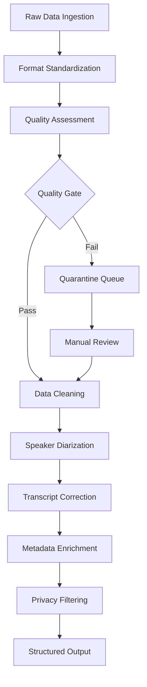
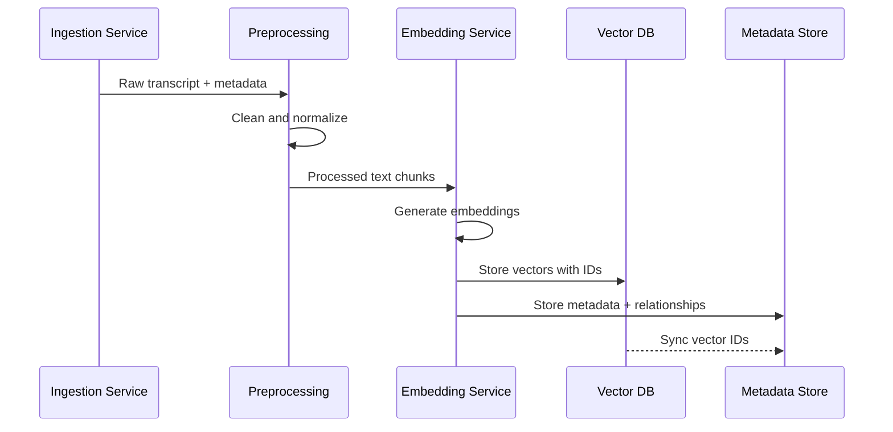
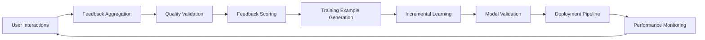
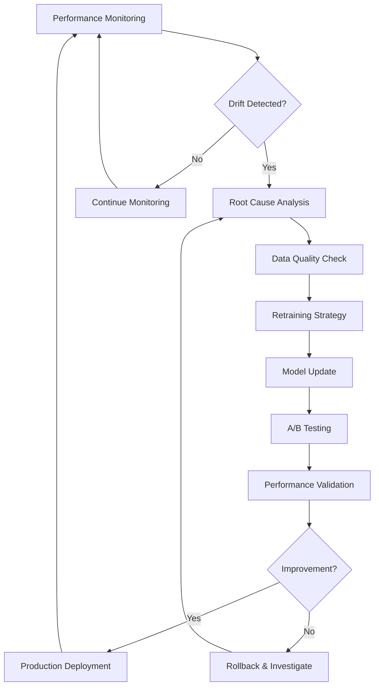

# Training Pipeline Specification
## AI Sales-Enablement Platform

### Overview

The training pipeline implements a continuous learning system that processes sales interactions, generates high-quality training data, and continuously improves model performance through feedback loops. The pipeline is designed for scalability, data quality, and rapid iteration cycles.

---

## 1. Transcript Ingestion and Preprocessing

### Data Sources & Formats

**Voice Platform Transcripts**:
- **Zoom**: JSON format with speaker identification, timestamps, confidence scores
- **Microsoft Teams**: VTT format with meeting metadata and participant information
- **Gong**: Proprietary format with conversation intelligence annotations
- **Generic**: Support for SRT, WebVTT, and plain text formats

**Email Communications**:
- **Raw Email**: MIME format with headers, threading information, attachments
- **Email Threads**: Conversation reconstruction with temporal ordering
- **Calendar Context**: Meeting invitations, follow-ups, and scheduling data

**CRM Data**:
- **Opportunity Records**: Deal stages, amounts, close dates, competitors
- **Contact Information**: Roles, company data, interaction history
- **Activity Logs**: Calls, emails, meetings, and task completions

### Preprocessing Pipeline



### Data Cleaning & Normalization

**Transcript Cleaning**:
```python
# Example preprocessing steps
def clean_transcript(raw_transcript):
    # Remove filler words and false starts
    cleaned = remove_fillers(raw_transcript, ['um', 'uh', 'like', 'you know'])
    
    # Correct common transcription errors
    cleaned = apply_domain_corrections(cleaned, sales_terminology_dict)
    
    # Normalize speaker labels
    cleaned = standardize_speakers(cleaned)
    
    # Add punctuation and capitalization
    cleaned = apply_punctuation_model(cleaned)
    
    return cleaned
```

**Data Validation**:
- **Completeness**: Minimum transcript length, required metadata fields
- **Quality**: Confidence scores, audio quality indicators, speaker clarity
- **Relevance**: Sales conversation detection, business context validation
- **Privacy**: PII detection and redaction, sensitive information filtering

### Speaker Diarization & Attribution

**Advanced Speaker Identification**:
- **Voice Biometrics**: Speaker embedding models for consistent identification
- **Context Clues**: Email signatures, calendar invitations, CRM role mapping
- **Confidence Scoring**: Reliability metrics for speaker attribution
- **Conflict Resolution**: Automated and manual review for ambiguous cases

---

## 2. Vector Embedding and Storage Strategy

### Embedding Model Architecture

**Multi-Modal Embedding Strategy**:
- **Text Embeddings**: Sentence-BERT fine-tuned on sales conversations
- **Semantic Embeddings**: Domain-specific models for sales terminology
- **Temporal Embeddings**: Time-aware representations for conversation flow
- **Contextual Embeddings**: CRM data integration for enriched representations

### Embedding Generation Pipeline



### Chunking Strategy

**Hierarchical Chunking**:
- **Conversation Level**: Entire call/email thread embeddings
- **Topic Level**: Semantic segmentation based on conversation topics
- **Turn Level**: Individual speaker turns with context windows
- **Sentence Level**: Fine-grained embeddings for precise retrieval

**Chunk Optimization**:
```python
def create_hierarchical_chunks(transcript):
    # Conversation-level chunk
    full_embedding = embed_text(transcript.full_text)
    
    # Topic-level chunks using semantic segmentation
    topics = segment_by_topic(transcript)
    topic_embeddings = [embed_text(topic.text) for topic in topics]
    
    # Turn-level chunks with context
    turns = []
    for i, turn in enumerate(transcript.turns):
        context = get_context_window(transcript.turns, i, window_size=3)
        turn_embedding = embed_text(f"{context}\n{turn.text}")
        turns.append(turn_embedding)
    
    return {
        'full': full_embedding,
        'topics': topic_embeddings,
        'turns': turns
    }
```

### Vector Database Design

**Database Selection**: Pinecone for managed service or Weaviate for self-hosted
**Index Configuration**:
- **Dimensions**: 768 (sentence-BERT) or 1536 (OpenAI embeddings)
- **Similarity Metric**: Cosine similarity for semantic search
- **Sharding Strategy**: By customer/tenant for data isolation
- **Replication**: Multi-region deployment for availability

**Metadata Schema**:
```json
{
  "id": "unique_chunk_identifier",
  "conversation_id": "parent_conversation_id",
  "chunk_type": "full|topic|turn|sentence",
  "timestamp": "2024-01-15T10:30:00Z",
  "speakers": ["sales_rep", "prospect"],
  "deal_stage": "qualification",
  "deal_value": 50000,
  "industry": "technology",
  "conversation_outcome": "meeting_scheduled",
  "quality_score": 0.85,
  "privacy_level": "internal"
}
```

---

## 3. Continuous Learning and Feedback Integration

### Feedback Collection System

**Multi-Channel Feedback**:
- **Direct User Feedback**: Thumbs up/down, corrections, quality ratings
- **Behavioral Signals**: Click-through rates, time spent, actions taken
- **Business Outcomes**: Deal progression, meeting bookings, email responses
- **A/B Testing**: Comparative performance across model versions

### Feedback Processing Pipeline



### Training Data Generation

**Positive Examples**:
- High-rated insights with user confirmations
- Successful conversation patterns leading to positive outcomes
- Effective email templates with high response rates
- Winning sales strategies from closed deals

**Negative Examples**:
- Low-rated or corrected model outputs
- Conversation patterns from lost deals
- Ineffective communication strategies
- Factually incorrect or irrelevant insights

**Data Augmentation**:
```python
def generate_training_examples(feedback_data):
    positive_examples = []
    negative_examples = []
    
    for feedback in feedback_data:
        if feedback.rating >= 4:  # High quality
            positive_examples.append({
                'input': feedback.query,
                'output': feedback.response,
                'context': feedback.retrieved_docs,
                'weight': feedback.confidence_score
            })
        elif feedback.rating <= 2:  # Low quality
            negative_examples.append({
                'input': feedback.query,
                'output': feedback.response,
                'correction': feedback.user_correction,
                'weight': 1.0 - feedback.confidence_score
            })
    
    return positive_examples, negative_examples
```

### Incremental Learning Strategy

**LoRA Adapter Updates**:
- **Frequency**: Weekly incremental updates with monthly full retraining
- **Data Requirements**: Minimum 100 high-quality examples per update
- **Validation**: Hold-out test set for performance verification
- **Rollback**: Automatic reversion if performance degrades

**Learning Rate Scheduling**:
- **Warm-up**: Gradual learning rate increase for stability
- **Decay**: Exponential decay to prevent catastrophic forgetting
- **Adaptive**: Learning rate adjustment based on validation performance

---

## 4. Model Evaluation and Drift Detection

### Evaluation Framework

**Automated Evaluation Metrics**:

```python
class ModelEvaluator:
    def __init__(self):
        self.metrics = {
            'relevance': SemanticSimilarityMetric(),
            'accuracy': FactualAccuracyMetric(),
            'coherence': CoherenceMetric(),
            'helpfulness': HelpfulnessMetric()
        }
    
    def evaluate_model(self, model, test_dataset):
        results = {}
        for metric_name, metric in self.metrics.items():
            score = metric.compute(model, test_dataset)
            results[metric_name] = score
        
        return results
```

**Business Impact Metrics**:
- **Sales Performance**: Deal velocity, win rates, average deal size
- **User Adoption**: Feature usage, session duration, return rates
- **Efficiency Gains**: Time saved on manual analysis, faster decision making
- **Quality Improvements**: Reduced errors, increased customer satisfaction

### Drift Detection System

**Statistical Drift Detection**:
```python
def detect_embedding_drift(current_embeddings, reference_embeddings):
    # Compute KL divergence between distributions
    kl_div = compute_kl_divergence(current_embeddings, reference_embeddings)
    
    # Population Stability Index
    psi = compute_psi(current_embeddings, reference_embeddings)
    
    # Wasserstein distance for distribution comparison
    wasserstein_dist = compute_wasserstein_distance(
        current_embeddings, reference_embeddings
    )
    
    drift_score = {
        'kl_divergence': kl_div,
        'psi': psi,
        'wasserstein': wasserstein_dist,
        'drift_detected': kl_div > 0.1 or psi > 0.2
    }
    
    return drift_score
```

**Performance Drift Monitoring**:
- **Response Quality**: Automated evaluation against golden datasets
- **User Satisfaction**: Trend analysis of feedback scores
- **Business Metrics**: Correlation with sales performance indicators
- **Technical Metrics**: Latency, throughput, error rates

### Alerting and Response System

**Alert Thresholds**:
- **Critical**: >20% performance degradation, immediate model rollback
- **Warning**: 10-20% degradation, accelerated retraining schedule
- **Info**: 5-10% degradation, increased monitoring frequency

**Automated Response Actions**:
1. **Immediate**: Circuit breaker activation, fallback to previous model
2. **Short-term**: Emergency retraining with recent high-quality data
3. **Medium-term**: Root cause analysis and architecture adjustments
4. **Long-term**: Comprehensive model architecture review

### Continuous Improvement Loop



---

## Implementation Timeline

### Phase 1: Foundation (Weeks 1-4)
- Data ingestion pipeline setup
- Basic preprocessing and cleaning
- Initial embedding generation
- Vector database deployment

### Phase 2: Core Training (Weeks 5-8)
- LoRA fine-tuning pipeline
- Feedback collection system
- Basic evaluation framework
- Initial model deployment

### Phase 3: Advanced Features (Weeks 9-12)
- Drift detection system
- Automated retraining
- A/B testing framework
- Performance optimization

### Phase 4: Production Hardening (Weeks 13-16)
- Monitoring and alerting
- Disaster recovery procedures
- Security hardening
- Documentation and training

---

## Success Metrics

**Technical Metrics**:
- **Model Performance**: >85% relevance score, <2s inference latency
- **Data Quality**: >90% successful preprocessing, <5% quarantine rate
- **System Reliability**: 99.9% uptime, <1% error rate

**Business Metrics**:
- **User Adoption**: >80% weekly active users, >4.0 satisfaction score
- **Sales Impact**: 15% improvement in deal velocity, 10% increase in win rate
- **Efficiency**: 30% reduction in manual analysis time

This training pipeline specification provides a comprehensive framework for continuous learning and improvement, ensuring the AI sales-enablement platform evolves with changing business needs and maintains high performance standards.
